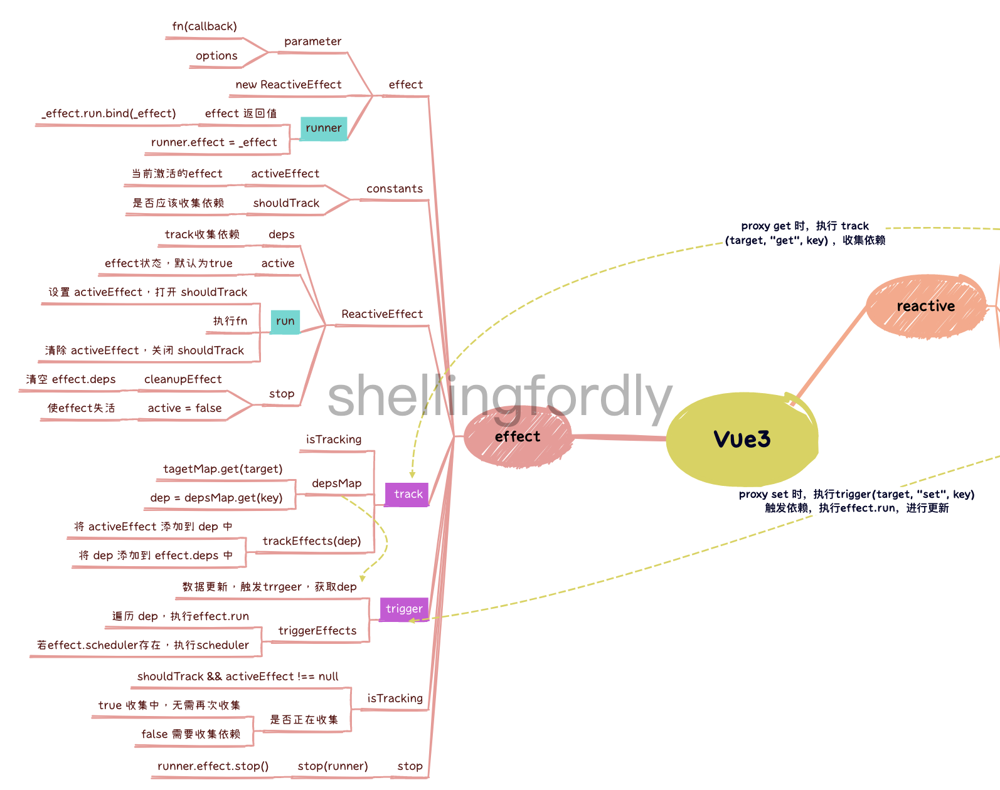
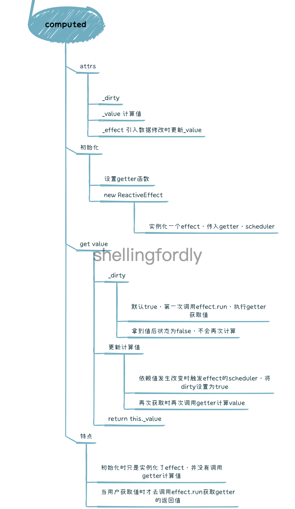

# mini-vue

[mini-vue](https://github.com/cuixiaorui/mini-vue)是由[cuixiaorui](https://github.com/cuixiaorui)编写的开源 vue3 学习项目，在[阮一峰周刊第 144 期](https://www.ruanyifeng.com/blog/2021/01/weekly-issue-144.html)中推荐过这个库，它实现最简 vue3 模型，用于深入学习 vue3，能够更轻松的理解 vue3 的核心逻辑。

此项目主要是为了学习 mini-vue，理解 vue3 核心逻辑，以及学习中的一些[思考与疑问](https://github.com/shellingfordly/mini-vue/blob/main/docs/think.md)记录，最后自己能够从头到尾的实现一遍 mini-vue。

## 思维导图

## 学习笔记

### reactivity

1. [reactive](https://github.com/shellingfordly/mini-vue/blob/main/docs/reactive.md)

2. effect

3. ref

4. computed

### runtime-core

### runtime-dom
