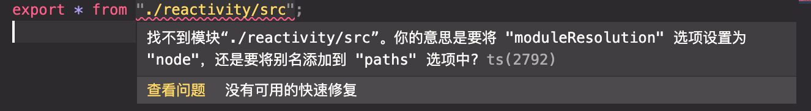

### 收集依赖

1. 总会有一种感觉在 tarck 的时候 activeEffect 是 null，就直接退出了 tarck 函数，为什么 trigger 里能调用到 effect.run 呢

有一个比较关键的点，当一个变量依赖另一个响应式变量的值时，就必然需要读取这个响应式变量，此时就会触发 get 函数内调用的 tarck 函数。

不管是 computed 计算属性还是 effect，都是想要在某个响应式变量发生改变时去做某件事，大部分情况下，传入 computed 和 effect 的回调函数内部都会调用这个响应式变量。因此，当 effect.run 执行时，内部执行到 this.fn（传入的回调）时，就会去触发 响应式变量的 get 内调用的 tarck 函数，此时 activeEffect 和 shouldTrack 还没有置空，就收集到了依赖。之后依赖变量改变时就会触发 trigger 去执行这些 effect 上的 run 函数

而 computed 不一样的是，在创建 effect 时，传入了第二个参数 scheduler，当有这个参数时，触发 trigger 执行的就不是 effect.run，而是 effect.scheduler。而 ComputedRef 内部利用一个\_dirty 变量去控制要不要执行(包含依赖变量的)回调函数。当依赖变量发生变化时，trigger 执行 effect.scheduler，打开了\_dirty 开关，再次获取计算属性时就会去重新执行回调函数，获取最新依赖值。

```ts
class ReactiveEffect {
  run() {
    activeEffect = this;
    shouldTrack = true;
    const res = this.fn();
    activeEffect = null;
    shouldTrack = false;
    return res;
  }
}

class ComputedRef {
  private _getter;
  private _dirty = true;
  private _value: any;
  private _effect: ReactiveEffect;

  constructor(getter) {
    this._getter = getter;

    this._effect = new ReactiveEffect(getter, () => {
      this._dirty = true;
    });
  }

  get value() {
    if (this._dirty) {
      this._dirty = false;
      this._value = this._effect.run();
    }

    return this._value;
  }
}

const count = reactive({ value: 1 });
const doubleCount = computed(() => count.value * 2);

effect(() => {
  count.value;
});
```

### 导入报错

tsconfig 需要配置 moduleResolution 属性为 node，否则导入文件时需要写出 index，而不能自动需要 index 文件



```json
{
  "compilerOptions": {
    "moduleResolution": "node"
  }
}
```
